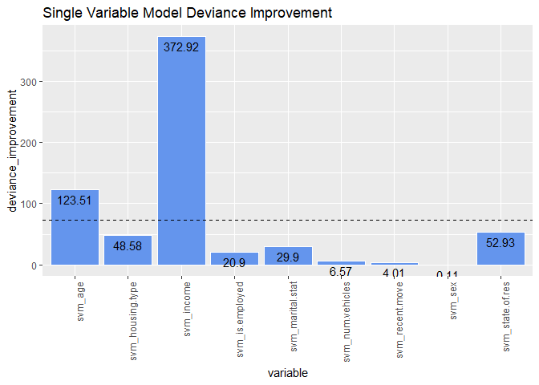

Feature Engineering & Selection with R
================

One of the most important steps in any Data Science project, or rather the most important one, is data cleaning and transformation. It's said that most of the time is spent in this particular step.

This step consists mainly of cleaning the messy data, getting it in shape for the model, transforming variables into more descriptive ones **(Feature Engineering)** and choosing the best variables for the predictive model we will use **(Feature Selection)**.

Here we will use **R** to demonstrate some of the techniques used in these two major concepts: Feature Engineering and Selection.

We will use the **custdata** dataset from [Practical Data Science with R](https://github.com/WinVector/zmPDSwR) book which I really recommend.

We will read the data into R and have a look at it.

###### The data can be downloaded from <https://github.com/WinVector/zmPDSwR/blob/master/Custdata/custdata.tsv>

``` r
custdata <- read.table('custdata.tsv', header = TRUE, sep = '\t')
head(custdata)
```

    ##   custid sex is.employed income  marital.stat health.ins
    ## 1   2068   F          NA  11300       Married       TRUE
    ## 2   2073   F          NA      0       Married       TRUE
    ## 3   2848   M        TRUE   4500 Never Married      FALSE
    ## 4   5641   M        TRUE  20000 Never Married      FALSE
    ## 5   6369   F        TRUE  12000 Never Married       TRUE
    ## 6   8322   F        TRUE 180000 Never Married       TRUE
    ##                   housing.type recent.move num.vehicles age state.of.res
    ## 1     Homeowner free and clear       FALSE            2  49     Michigan
    ## 2                       Rented        TRUE            3  40      Florida
    ## 3                       Rented        TRUE            3  22      Georgia
    ## 4        Occupied with no rent       FALSE            0  22   New Mexico
    ## 5                       Rented        TRUE            1  31      Florida
    ## 6 Homeowner with mortgage/loan       FALSE            1  40     New York

``` r
summary(custdata)
```

    ##      custid        sex     is.employed         income      
    ##  Min.   :   2068   F:440   Mode :logical   Min.   : -8700  
    ##  1st Qu.: 345667   M:560   FALSE:73        1st Qu.: 14600  
    ##  Median : 693403           TRUE :599       Median : 35000  
    ##  Mean   : 698500           NA's :328       Mean   : 53505  
    ##  3rd Qu.:1044606                           3rd Qu.: 67000  
    ##  Max.   :1414286                           Max.   :615000  
    ##                                                            
    ##              marital.stat health.ins     
    ##  Divorced/Separated:155   Mode :logical  
    ##  Married           :516   FALSE:159      
    ##  Never Married     :233   TRUE :841      
    ##  Widowed           : 96                  
    ##                                          
    ##                                          
    ##                                          
    ##                        housing.type recent.move      num.vehicles  
    ##  Homeowner free and clear    :157   Mode :logical   Min.   :0.000  
    ##  Homeowner with mortgage/loan:412   FALSE:820       1st Qu.:1.000  
    ##  Occupied with no rent       : 11   TRUE :124       Median :2.000  
    ##  Rented                      :364   NA's :56        Mean   :1.916  
    ##  NA's                        : 56                   3rd Qu.:2.000  
    ##                                                     Max.   :6.000  
    ##                                                     NA's   :56     
    ##       age              state.of.res
    ##  Min.   :  0.0   California  :100  
    ##  1st Qu.: 38.0   New York    : 71  
    ##  Median : 50.0   Pennsylvania: 70  
    ##  Mean   : 51.7   Texas       : 56  
    ##  3rd Qu.: 64.0   Michigan    : 52  
    ##  Max.   :146.7   Ohio        : 51  
    ##                  (Other)     :600

``` r
dim(custdata)
```

    ## [1] 1000   11

#### NA Imputation

We will begin with **imputing the missing values**.

``` r
### sum of all missing fields in the data and looking at the columns containing them 
sum(is.na(custdata))
```

    ## [1] 496

``` r
missing_cols <- table(which(is.na(custdata), arr.ind = T)[, 2])
summary(custdata[, as.numeric(names(missing_cols))])
```

    ##  is.employed                           housing.type recent.move    
    ##  Mode :logical   Homeowner free and clear    :157   Mode :logical  
    ##  FALSE:73        Homeowner with mortgage/loan:412   FALSE:820      
    ##  TRUE :599       Occupied with no rent       : 11   TRUE :124      
    ##  NA's :328       Rented                      :364   NA's :56       
    ##                  NA's                        : 56                  
    ##                                                                    
    ##                                                                    
    ##   num.vehicles  
    ##  Min.   :0.000  
    ##  1st Qu.:1.000  
    ##  Median :2.000  
    ##  Mean   :1.916  
    ##  3rd Qu.:2.000  
    ##  Max.   :6.000  
    ##  NA's   :56

##### First we will deal with the missing data from a categorical variable

As we see most of the missing data comes from one column "is.employed". This can mean a lot, so this is one of the situations where domain knowledge comes into help to know what is exactly this data can represent.

One of the solutions is to transform missing values into a new category:

``` r
custdata$is.employed <- as.factor(
  ifelse(is.na(custdata$is.employed),
         "missing",
         ifelse(custdata$is.employed == T,
                "employed",
                "not employed")
  ))
summary(custdata$is.employed)
```

    ##     employed      missing not employed 
    ##          599          328           73

##### Dealing with missing values from a numeric variable

We will insert some NA values randomly into "income"" variable;

``` r
summary(custdata$income)
```

    ##    Min. 1st Qu.  Median    Mean 3rd Qu.    Max. 
    ##   -8700   14600   35000   53505   67000  615000

``` r
custdata[sample(1:nrow(custdata), 56), "income"] <- NA
summary(custdata$income)
```

    ##    Min. 1st Qu.  Median    Mean 3rd Qu.    Max.    NA's 
    ##   -8700   14400   34350   52643   65000  615000      56

The most common solution with NA values in a numeric value is to impute them into the mean or average value in the variable:

``` r
mean_income <- mean(custdata$income, na.rm = TRUE)
custdata$income <- ifelse(is.na(custdata$income),
                          mean_income,
                          custdata$income)
summary(custdata$income)
```

    ##    Min. 1st Qu.  Median    Mean 3rd Qu.    Max. 
    ##   -8700   15000   36740   52643   62000  615000

The data is yes affected but not too much from the original one.

##### Dropping rows with missing values

if the missing values come mainly from some specific rows, we can confidently drop them. Here we can see that almost all the missing values for "recent.move" and "num.vehicles" are accompanied with the missing values for "housing.type" variable.

``` r
summary(custdata[is.na(custdata$housing.type),
                 c("recent.move", "num.vehicles")])
```

    ##  recent.move     num.vehicles
    ##  Mode:logical   Min.   : NA  
    ##  NA's:56        1st Qu.: NA  
    ##                 Median : NA  
    ##                 Mean   :NaN  
    ##                 3rd Qu.: NA  
    ##                 Max.   : NA  
    ##                 NA's   :56

So we will drop the rows containing them all.

``` r
custdata <- custdata[complete.cases(custdata),]
d <- custdata # we will use it later
dim(custdata)
```

    ## [1] 944  11

#### Variable Transformation

##### Log Transformation for numeric variables.

Some numeric variables have log distribution which can be spotted with a density plot it is skewed to one side:

``` r
suppressMessages(library(ggplot2))
suppressMessages(library(scales))

## log_income
ggplot(custdata, aes(x = income)) + 
  geom_density(fill = "purple", color = "white", alpha = 0.5) +
  scale_x_continuous(labels = dollar) + theme_minimal() 
```


When we take the log of the variable:

``` r
ggplot(custdata, aes(x = income)) + 
  geom_density(fill = "purple", color = "white", alpha = 0.5) +
  scale_x_log10(breaks = c(100, 1000, 10000, 100000), labels = dollar) +
  xlab("log income") + theme_minimal()
```


###### Binarization

Another way to deal with numeric variable is to binarize it or to transform it into a binary categorical variable if the the numeric variableis distributed around a specifici number or threshold.

``` r
ggplot(custdata, aes(x = income, fill = health.ins)) +
  geom_density(color = 'white', alpha = 0.6, size = 0.5) +
  theme_minimal() + scale_fill_brewer(palette = 'Set1') +
  scale_x_log10(breaks = c(100, 1000, 10000, 100000), labels = dollar)
```


``` r
ggplot(custdata, aes(x = income, y = as.numeric(health.ins))) +
  geom_point() + geom_smooth() + scale_x_log10(labels = dollar) +
  theme_minimal()
```

    ## `geom_smooth()` using method = 'loess' and formula 'y ~ x'


Here we can see that above 20K or 30k income, people tend to have "health insurance" more than people below this threshold.

``` r
binarized_income <- ifelse(custdata$income >= 30000,
                           ">=30K",
                           "<30K")
table(binarized_income)
```

    ## binarized_income
    ##  <30K >=30K 
    ##   370   574

##### Descretization

One more way is to discretize numeric values into categorical ranges:

``` r
probs <- quantile(custdata$age, probs = seq(0.1, 1, 0.1), na.rm = T)
age_groups <-
  cut(custdata$age,
      breaks = probs, include.lowest = T)
summary(age_groups)
# to remove NAs
#gp_with_no_na <- addNA(age_groups)
levels(gp_with_no_na) <- c(levels(age_groups), "newlevel")
summary(gp_with_no_na)

```

    ##  [29,36]  (36,41]  (41,46]  (46,50]  (50,55]  (55,60]  (60,67]  (67,76] 
    ##      115       99       92       87      101       86      102       87 
    ## (76,147]     NA's 
    ##       92       83

Here, looking at the age variable, we are not interested very much with the values themselves. But the age ranges are rather more important.

##### Normalization

Another way to deal with numeric variables is to normalize them. There are two ways to normalize:

1- against the variable range (max and min)

``` r
range_normalize <- function(x){
  (x - min(x)) / (max(x) - min(x))
}
custdata[, "range_normalized_age"] <- range_normalize(custdata$age)
summary(custdata$range_normalized_age)
```

    ##    Min. 1st Qu.  Median    Mean 3rd Qu.    Max. 
    ##  0.0000  0.2659  0.3409  0.3541  0.4363  1.0000

2- against Mean/Average or Median of the variable itself

``` r
summary(custdata$age)
```

    ##    Min. 1st Qu.  Median    Mean 3rd Qu.    Max. 
    ##    0.00   39.00   50.00   51.93   64.00  146.68

``` r
custdata$normalized_age <- custdata$age / mean(custdata$age)
summary(custdata$normalized_age)
```

    ##    Min. 1st Qu.  Median    Mean 3rd Qu.    Max. 
    ##  0.0000  0.7510  0.9628  1.0000  1.2324  2.8244

``` r
## more insights
custdata$age_gps <- factor(ifelse(custdata$normalized_age >= 1, "old", "young"))
ggplot(custdata, aes(x = age, fill = age_gps)) + 
  geom_density(color = "white", alpha = 0.5) + theme_minimal() +
  scale_fill_brewer(palette = 'Set1')
```


3- against mean/average or median of a group or category

``` r
suppressMessages(library(dplyr))
table(custdata$state.of.res)
```

    ## 
    ##        Alabama         Alaska        Arizona       Arkansas     California 
    ##             10              3              9              6             91 
    ##       Colorado    Connecticut       Delaware        Florida        Georgia 
    ##             11             14              1             45             24 
    ##         Hawaii          Idaho       Illinois        Indiana           Iowa 
    ##              4              3             49             28             10 
    ##         Kansas       Kentucky      Louisiana          Maine       Maryland 
    ##              4             15             15              5             16 
    ##  Massachusetts       Michigan      Minnesota    Mississippi       Missouri 
    ##             24             51             20              2             20 
    ##        Montana       Nebraska         Nevada  New Hampshire     New Jersey 
    ##              2              8              4              5             36 
    ##     New Mexico       New York North Carolina   North Dakota           Ohio 
    ##              6             70             15              1             49 
    ##       Oklahoma         Oregon   Pennsylvania   Rhode Island South Carolina 
    ##             11              7             65              2             14 
    ##   South Dakota      Tennessee          Texas           Utah        Vermont 
    ##              5             21             54              4              3 
    ##       Virginia     Washington  West Virginia      Wisconsin        Wyoming 
    ##             26             17             12             26              1

``` r
median_income <- custdata %>% group_by(state.of.res) %>%
  summarise(state_median_income = median(income, na.rm = TRUE))

dim(median_income)
```

    ## [1] 50  2

``` r
custdata <- merge(custdata, median_income,
                     by = "state.of.res")

custdata$normalized_income <- with(custdata, income / state_median_income)
summary(custdata$normalized_income)
```

    ##    Min. 1st Qu.  Median    Mean 3rd Qu.    Max.    NA's 
    ## -0.1933  0.4600  1.0000  1.4147  1.6756 15.3750       1

##### Scaling

One more way is to scale the variables.

``` r
custdata$scaled_age <- (custdata$age - mean(custdata$age)) / sd(custdata$age)
summary(custdata$scaled_age)
```

    ##    Min. 1st Qu.  Median    Mean 3rd Qu.    Max. 
    ## -2.8166 -0.7014 -0.1048  0.0000  0.6545  5.1387

###### The idea behind normalizing and scaling is to get all the numeric variables into a reasonable range so that variables with bigger numbers like income don't have greater effect in the model than those of smaller numbers like age

#### Dealing with Categorical Variables:

Sometimes we need to transform categorical variables for example when a variable contains many categories or using an algorithm that only accepts numbers.

##### One-hot encoding

One way is to one-hot encode the variable: transform each category into a new column containing 1 or 0 according to their existence.

``` r
### one-hot encoding
vars <- colnames(custdata)

## to one hot encode factor values and normalize numeric ones if needed
cat_vars <- vars[sapply(custdata[, vars], class) %in%
                   c("factor", "character", "logical")]
cat_vars <- cat_vars[-1] #state of res
custdata2 <- custdata[, cat_vars]
for (i in cat_vars) {
  dict <- unique(custdata2[, i])
  for (key in dict) {
    custdata2[[paste0(i, "_", key)]] <- 1.0 * (custdata2[, i] == key)
  }
}
# to remove the original categorical variables
#custdata[, which(colnames(custdata) %in% cat_vars)] <- NULL
head(custdata2)
```

    ##   sex  is.employed       marital.stat health.ins
    ## 1   F      missing            Married       TRUE
    ## 2   F     employed Divorced/Separated       TRUE
    ## 3   F     employed            Widowed       TRUE
    ## 4   M not employed            Married       TRUE
    ## 5   F     employed            Married       TRUE
    ## 6   M     employed            Married       TRUE
    ##                   housing.type recent.move age_gps sex_F sex_M
    ## 1     Homeowner free and clear       FALSE     old     1     0
    ## 2                       Rented       FALSE   young     1     0
    ## 3                       Rented       FALSE     old     1     0
    ## 4 Homeowner with mortgage/loan       FALSE     old     0     1
    ## 5 Homeowner with mortgage/loan       FALSE     old     1     0
    ## 6                       Rented       FALSE   young     0     1
    ##   is.employed_missing is.employed_employed is.employed_not employed
    ## 1                   1                    0                        0
    ## 2                   0                    1                        0
    ## 3                   0                    1                        0
    ## 4                   0                    0                        1
    ## 5                   0                    1                        0
    ## 6                   0                    1                        0
    ##   marital.stat_Married marital.stat_Divorced/Separated
    ## 1                    1                               0
    ## 2                    0                               1
    ## 3                    0                               0
    ## 4                    1                               0
    ## 5                    1                               0
    ## 6                    1                               0
    ##   marital.stat_Widowed marital.stat_Never Married health.ins_TRUE
    ## 1                    0                          0               1
    ## 2                    0                          0               1
    ## 3                    1                          0               1
    ## 4                    0                          0               1
    ## 5                    0                          0               1
    ## 6                    0                          0               1
    ##   health.ins_FALSE housing.type_Homeowner free and clear
    ## 1                0                                     1
    ## 2                0                                     0
    ## 3                0                                     0
    ## 4                0                                     0
    ## 5                0                                     0
    ## 6                0                                     0
    ##   housing.type_Rented housing.type_Homeowner with mortgage/loan
    ## 1                   0                                         0
    ## 2                   1                                         0
    ## 3                   1                                         0
    ## 4                   0                                         1
    ## 5                   0                                         1
    ## 6                   1                                         0
    ##   housing.type_Occupied with no rent recent.move_FALSE recent.move_TRUE
    ## 1                                  0                 1                0
    ## 2                                  0                 1                0
    ## 3                                  0                 1                0
    ## 4                                  0                 1                0
    ## 5                                  0                 1                0
    ## 6                                  0                 1                0
    ##   age_gps_old age_gps_young
    ## 1           1             0
    ## 2           0             1
    ## 3           1             0
    ## 4           1             0
    ## 5           1             0
    ## 6           0             1

##### Conditional Probability

Another way is to convert every category into its odds ratio. This technique is useful when dealing with variables with so many categories. N.B. This technique assumes that historical data is available for computing the statistics.

``` r
table(custdata$marital.stat) #predictor
```

    ## 
    ## Divorced/Separated            Married      Never Married 
    ##                149                507                198 
    ##            Widowed 
    ##                 90

``` r
table(custdata$health.ins) #outcome
```

    ## 
    ## FALSE  TRUE 
    ##   137   807

``` r
with(custdata, table(marital.stat, health.ins))
```

    ##                     health.ins
    ## marital.stat         FALSE TRUE
    ##   Divorced/Separated    20  129
    ##   Married               58  449
    ##   Never Married         54  144
    ##   Widowed                5   85

``` r
odds_ratio <- function(x, y, pos, logarithm = FALSE) {
  prob_table <- table(as.factor(y), x)
  vals <- unique(y)
  neg <- vals[which(vals != pos)]
  outcome_prob <- sum(y == pos, na.rm = T) / length(y)
  odds_ratio <-
  (prob_table[pos,] + 0.001) / (prob_table[neg, ] + 0.001)
  odds <- odds_ratio[x]
  odds[is.na(odds)] <- outcome_prob
  if (logarithm) {
  odds <- log(odds)
  }
  odds
}

vars <- colnames(custdata)
custdata3 <- custdata
cat_vars <- vars[sapply(custdata[, vars], class) %in% 
                   c("factor", "character", "logical")]
cat_vars <- cat_vars[which(cat_vars != "health.ins")] 
custdata3[, cat_vars] <- apply(custdata3[, cat_vars], 2,
                              function(x, y, pos) {
                              odds_ratio(x, as.factor(custdata3$health.ins),
                              "TRUE")
                              })
head(custdata3)
```

    ##   state.of.res  custid      sex is.employed income marital.stat health.ins
    ## 1     8.992008  799074 6.083249    9.370060  56500     7.741263       TRUE
    ## 2     8.992008  572341 6.083249    6.120420  16000     6.449728       TRUE
    ## 3     8.992008 1089530 6.083249    6.120420  48000    16.996801       TRUE
    ## 4     8.992008  988264 5.740198    1.703678   5000     7.741263       TRUE
    ## 5     8.992008 1197386 6.083249    6.120420  25000     7.741263       TRUE
    ## 6     8.992008  999444 5.740198    6.120420  24000     7.741263       TRUE
    ##   housing.type recent.move num.vehicles age range_normalized_age
    ## 1    12.082410    6.321381            3  74            0.5044989
    ## 2     3.232532    6.321381            1  36            0.2454319
    ## 3     3.232532    6.321381            1  54            0.3681479
    ## 4    10.444182    6.321381            5  55            0.3749654
    ## 5    10.444182    6.321381            2  55            0.3749654
    ## 6     3.232532    6.321381            2  24            0.1636213
    ##   normalized_age   age_gps state_median_income normalized_income
    ## 1      1.4249110 12.575407               23000         2.4565217
    ## 2      0.6932000  3.769204               23000         0.6956522
    ## 3      1.0398000 12.575407               23000         2.0869565
    ## 4      1.0590555 12.575407               23000         0.2173913
    ## 5      1.0590555 12.575407               23000         1.0869565
    ## 6      0.4621333  3.769204               23000         1.0434783
    ##   scaled_age
    ## 1  1.1968218
    ## 2 -0.8641455
    ## 3  0.1121022
    ## 4  0.1663382
    ## 5  0.1663382
    ## 6 -1.5149773

### Feature Selection

There are so many techinques to select the best variables for our predictive models.

1- Filter methods: to filter variables based on some criteria like R-Squared.

2- Wrapper methods: This method treats the features selection process as a search problem, where different combinations of features are tested against performance criteria and compared with other combinations.

3- Embedded methods: like decision tree, the algorithm itself ranks the variables and select the best cutting criteria for them.

Here we are going to explore the Filtering Methods. We are going to modify the odds\_ratio function to compute the **conditional probability** for both numeric and categorical variables building **Single Variable Model** for each variable and compute the loglikelihood for each one then compute the improvement of **model deviance** against **null deviance** for each single variable model and then compute the **R-Squared** for each single variable model and rank the variables according to their scores and then subset them based on a certain threshold.

``` r
## Single Variable Model Function
single_variable_model <- function(x, y, pos) {
  if (class(x) %in% c("numeric", "integer")) {
    # if numeric descretize it
    probs <- unique(quantile(x, probs = seq(0.1, 1, 0.1), na.rm = T))
    x <- cut(x, breaks = probs, include.lowest = T)
  }
  prob_table <- table(as.factor(y), x)
  vals <- unique(y)
  neg <- vals[which(vals != pos)]
  outcome_prob <- sum(y == pos, na.rm = T) / length(y) #outcome probability
  cond_prob <-
    (prob_table[pos,] + 0.001 * outcome_prob) /
    (colSums(prob_table) + 0.001) # probability of outcome given variable
  cond_prob_model <- cond_prob[x]
  cond_prob_model[is.na(cond_prob_model)] <- outcome_prob
  cond_prob_model
}
```

Split data into train and test.

``` r
head(d) #original custdata
```

    ##   custid sex is.employed income  marital.stat health.ins
    ## 1   2068   F     missing  11300       Married       TRUE
    ## 2   2073   F     missing      0       Married       TRUE
    ## 3   2848   M    employed   4500 Never Married      FALSE
    ## 4   5641   M    employed  20000 Never Married      FALSE
    ## 5   6369   F    employed  12000 Never Married       TRUE
    ## 6   8322   F    employed 180000 Never Married       TRUE
    ##                   housing.type recent.move num.vehicles age state.of.res
    ## 1     Homeowner free and clear       FALSE            2  49     Michigan
    ## 2                       Rented        TRUE            3  40      Florida
    ## 3                       Rented        TRUE            3  22      Georgia
    ## 4        Occupied with no rent       FALSE            0  22   New Mexico
    ## 5                       Rented        TRUE            1  31      Florida
    ## 6 Homeowner with mortgage/loan       FALSE            1  40     New York

``` r
set.seed(13)
d$split <- runif(nrow(d))
train <- subset(d, split <= 0.9)
test <- subset(d, split > 0.9)
train$split <- test$split <- NULL
```

Function to calculate AUC for each Single Variable Model.

``` r
suppressMessages(library(ROCR))
auc <- function(model, outcome, pos) { 
  per <- performance(prediction(model, outcome == pos),
                     "auc")
  as.numeric(per@y.values)
}
```

Build the **Single Variable Model** for each variable.

``` r
vars <- setdiff(colnames(train), c("custid", "health.ins"))
train[, paste0("svm_", vars)] <- apply(train[, vars], 2,
                                       function(x, y, pos) {
                                       single_variable_model(x, as.factor(train$health.ins),
                                       "TRUE")
                                       })
test[, paste0("svm_", vars)] <- apply(test[, vars], 2,
                                      function(x, y, pos) {
                                        single_variable_model(x, as.factor(test$health.ins),
                                                              "TRUE")
                                      })

head(train)
```

    ##   custid sex is.employed income  marital.stat health.ins
    ## 1   2068   F     missing  11300       Married       TRUE
    ## 2   2073   F     missing      0       Married       TRUE
    ## 3   2848   M    employed   4500 Never Married      FALSE
    ## 4   5641   M    employed  20000 Never Married      FALSE
    ## 6   8322   F    employed 180000 Never Married       TRUE
    ## 7   8521   M    employed 120000 Never Married       TRUE
    ##                   housing.type recent.move num.vehicles age state.of.res
    ## 1     Homeowner free and clear       FALSE            2  49     Michigan
    ## 2                       Rented        TRUE            3  40      Florida
    ## 3                       Rented        TRUE            3  22      Georgia
    ## 4        Occupied with no rent       FALSE            0  22   New Mexico
    ## 6 Homeowner with mortgage/loan       FALSE            1  40     New York
    ## 7     Homeowner free and clear        TRUE            1  39        Idaho
    ##     svm_sex svm_is.employed   svm_income svm_marital.stat svm_housing.type
    ## 1 0.8544974       0.8991934 0.9998589785        0.8888888        0.9379305
    ## 2 0.8544974       0.8991934 0.6136419363        0.8888888        0.7554862
    ## 3 0.8623656       0.8646616 0.0008579795        0.7294125        0.7554862
    ## 4 0.8623656       0.8646616 0.8000117651        0.7294125        0.7000159
    ## 6 0.8544974       0.8646616 0.9999647182        0.7294125        0.9214090
    ## 7 0.8623656       0.8646616 0.9999798368        0.7294125        0.9379305
    ##   svm_recent.move svm_num.vehicles   svm_age svm_state.of.res
    ## 1       0.8686730        0.8513932 0.8888872        0.8510640
    ## 2       0.7946434        0.9112899 0.8260884        0.9499977
    ## 3       0.7946434        0.9112899 0.6000518        0.8095262
    ## 4       0.8686730        0.8163274 0.6000518        0.8333376
    ## 6       0.8686730        0.8513011 0.8260884        0.8000009
    ## 7       0.7946434        0.8513011 0.9473638        0.9999530

``` r
head(test)
```

    ##    custid sex is.employed income  marital.stat health.ins
    ## 5    6369   F    employed  12000 Never Married       TRUE
    ## 34  46099   M    employed  36880 Never Married       TRUE
    ## 44  52436   F    employed 139000       Married       TRUE
    ## 47  53759   F     missing      0       Married       TRUE
    ## 55  67776   M    employed  52000       Married       TRUE
    ## 79  98086   M     missing  52100       Married       TRUE
    ##                    housing.type recent.move num.vehicles age  state.of.res
    ## 5                        Rented        TRUE            1  31       Florida
    ## 34 Homeowner with mortgage/loan       FALSE            2  65 Massachusetts
    ## 44 Homeowner with mortgage/loan       FALSE            2  46  Pennsylvania
    ## 47 Homeowner with mortgage/loan       FALSE            2  34          Ohio
    ## 55 Homeowner with mortgage/loan       FALSE            1  38       Florida
    ## 79 Homeowner with mortgage/loan        TRUE            2  69       Florida
    ##      svm_sex svm_is.employed svm_income svm_marital.stat svm_housing.type
    ## 5  0.8936155       0.8135595  0.5001608        0.7142896        0.8222222
    ## 34 0.7592604       0.8135595  0.9998220        0.7142896        0.8372089
    ## 44 0.8936155       0.8135595  0.9998220        0.8541660        0.8372089
    ## 47 0.8936155       0.9374964  0.4286276        0.8541660        0.8372089
    ## 55 0.7592604       0.8135595  0.9999109        0.8541660        0.8372089
    ## 79 0.7592604       0.9374964  0.9998220        0.8541660        0.8372089
    ##    svm_recent.move svm_num.vehicles   svm_age svm_state.of.res
    ## 5        0.8333324        0.7812513 0.9999109        0.9999644
    ## 34       0.8202247        0.8974340 0.9999109        0.9999555
    ## 44       0.8202247        0.8974340 0.9999109        0.8999922
    ## 47       0.8202247        0.8974340 0.9999109        0.8000044
    ## 55       0.8202247        0.7812513 0.9999406        0.9999644
    ## 79       0.8333324        0.8974340 0.9999109        0.9999644

AUC for each built SVM

``` r
svm_vars <- grep("svm_", colnames(train), value = TRUE)
for(i in svm_vars){
  train_svm_auc <- auc(train[, i], train$health.ins, "TRUE")
  print(sprintf("%s: train_AUC: %4.3f",
                i, train_svm_auc))
}
```

    ## [1] "svm_sex: train_AUC: 0.508"
    ## [1] "svm_is.employed: train_AUC: 0.591"
    ## [1] "svm_income: train_AUC: 0.941"
    ## [1] "svm_marital.stat: train_AUC: 0.633"
    ## [1] "svm_housing.type: train_AUC: 0.675"
    ## [1] "svm_recent.move: train_AUC: 0.535"
    ## [1] "svm_num.vehicles: train_AUC: 0.551"
    ## [1] "svm_age: train_AUC: 0.787"
    ## [1] "svm_state.of.res: train_AUC: 0.675"

Compute loglikelihood, deviance and R-Squared for the models and rank the variables.

``` r
loglikelihood <- function(y, py) {
  sum(y * log(py) + (1 - y) * log(1 - py))
}

outcome <- "health.ins"
pos <- "TRUE"

pnull <- sum(train[, outcome] == pos) / length(train[, outcome])
null_deviance <- -2 * loglikelihood(as.numeric(train$health.ins), pnull)

sv_model_deviance <- c()
variable <- c()
for(i in svm_vars){
  sv_model_deviance <- c(sv_model_deviance,
                         -2 * loglikelihood(as.numeric(train$health.ins), 
                                            train[, i]))
  variable <- c(variable, i)
}
names(sv_model_deviance) <- variable
sv_model_deviance
```

    ##          svm_sex  svm_is.employed       svm_income svm_marital.stat 
    ##         686.2106         665.4148         313.3968         656.4158 
    ## svm_housing.type  svm_recent.move svm_num.vehicles          svm_age 
    ##         637.7329         682.3076         679.7469         562.8025 
    ## svm_state.of.res 
    ##         633.3886

``` r
deviance_improvement <- null_deviance - sv_model_deviance
sort(deviance_improvement, decreasing = TRUE)
```

    ##       svm_income          svm_age svm_state.of.res svm_housing.type 
    ##      372.9201848      123.5144166       52.9283802       48.5840938 
    ## svm_marital.stat  svm_is.employed svm_num.vehicles  svm_recent.move 
    ##       29.9011729       20.9021276        6.5700154        4.0093474 
    ##          svm_sex 
    ##        0.1063151

``` r
ggplot(
  data.frame(
    variable = names(deviance_improvement),
    deviance_improvement = round(deviance_improvement, 2)
    ),
  aes(x = variable, y = deviance_improvement)
  ) +
  geom_bar(stat = "identity", color = "white", fill = "cornflowerblue") +
  # threshold
  geom_hline(yintercept = mean(deviance_improvement), linetype = "dashed") +
  geom_text(aes(label = deviance_improvement), color = "black", vjust = 1.5) +
  theme(axis.text.x = element_text(angle = 90, hjust = 1)) +
  ggtitle("Single Variable Model Deviance Improvement") 
```



``` r
sv_pseudo_rsquared <- 1 - (sv_model_deviance / null_deviance)
sort(sv_pseudo_rsquared, decreasing = TRUE)
```

    ##       svm_income          svm_age svm_state.of.res svm_housing.type 
    ##     0.5433643704     0.1799670170     0.0771194404     0.0707895860 
    ## svm_marital.stat  svm_is.employed svm_num.vehicles  svm_recent.move 
    ##     0.0435675854     0.0304555019     0.0095728588     0.0058418306 
    ##          svm_sex 
    ##     0.0001549067

``` r
rsq <- data.frame(variable = names(sv_pseudo_rsquared),
                  Rsquared = round(sv_pseudo_rsquared, 2), 
                  selected = ifelse(sv_pseudo_rsquared >= mean(sv_pseudo_rsquared), 
                                    "good candidate", "bad candidate"))

ggplot(rsq, aes(x = Rsquared, y = reorder(variable, Rsquared))) +
  geom_point(aes(color = selected), size = 2) +
  scale_color_brewer(palette = "Set1") +
  theme_bw() +
  theme(
    # No vertical grid lines
    panel.grid.major.x = element_blank(),
    panel.grid.minor.x = element_blank(),
    # horizontal grid
    panel.grid.major.y = element_line(colour = "grey60", linetype = "dashed"),
    legend.position = c(1, 0.55),
    # Put legend inside plot area
    legend.justification = c(1, 0.5)
    ) +
  # threshold
  geom_vline(xintercept = mean(sv_pseudo_rsquared), linetype = "dashed") +
  xlab("SVM Pseudo R-Squared") + ylab("Variable") +
  ggtitle("Single Variable Model Pseudo R-Squared")
```


Select Variables based on a threshold

``` r
selected_vars <- names(sv_pseudo_rsquared)[which(sv_pseudo_rsquared >= 0.1)]
selected_vars
```

    ## [1] "svm_income" "svm_age"

Build our classification model using the selected variables and evaluate it on test dataset calculating its train and test AUCs.

``` r
glm_model <- glm(health.ins ~ .,
                 data = train[, c("health.ins", selected_vars)],
                 family = binomial(link = "logit"))
summary(glm_model)
```

    ## 
    ## Call:
    ## glm(formula = health.ins ~ ., family = binomial(link = "logit"), 
    ##     data = train[, c("health.ins", selected_vars)])
    ## 
    ## Deviance Residuals: 
    ##      Min        1Q    Median        3Q       Max  
    ## -2.84741   0.09736   0.15017   0.26031   2.39533  
    ## 
    ## Coefficients:
    ##             Estimate Std. Error z value Pr(>|z|)    
    ## (Intercept) -10.9740     1.1975  -9.164  < 2e-16 ***
    ## svm_income    8.9233     0.8265  10.796  < 2e-16 ***
    ## svm_age       7.4017     1.1657   6.350 2.16e-10 ***
    ## ---
    ## Signif. codes:  0 '***' 0.001 '**' 0.01 '*' 0.05 '.' 0.1 ' ' 1
    ## 
    ## (Dispersion parameter for binomial family taken to be 1)
    ## 
    ##     Null deviance: 686.32  on 842  degrees of freedom
    ## Residual deviance: 302.25  on 840  degrees of freedom
    ## AIC: 308.25
    ## 
    ## Number of Fisher Scoring iterations: 7

``` r
train$glm_model <- predict(glm_model, train,
                           type = "response")
auc(train$glm_model, train$health.ins, "TRUE")
```

    ## [1] 0.9540891

``` r
suppressMessages(library(WVPlots))
WVPlots::ROCPlot(train, 
                 "glm_model", outcome, pos,
                 'train performance')
```


``` r
### On test dataset
test$glm_model <- predict(glm_model, test,
                          type = "response")
auc(test$glm_model, test$health.ins, "TRUE")
```

    ## [1] 0.9983266

``` r
WVPlots::ROCPlot(test, 
                 "glm_model", outcome, pos,
                 'test performance')
```


